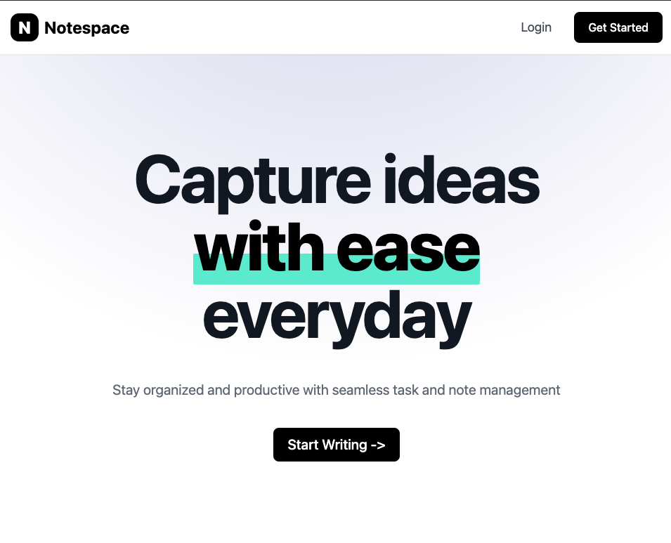
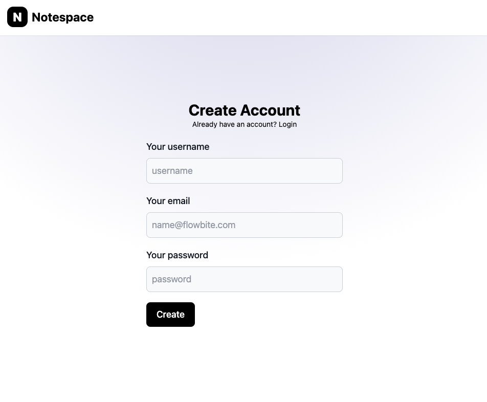
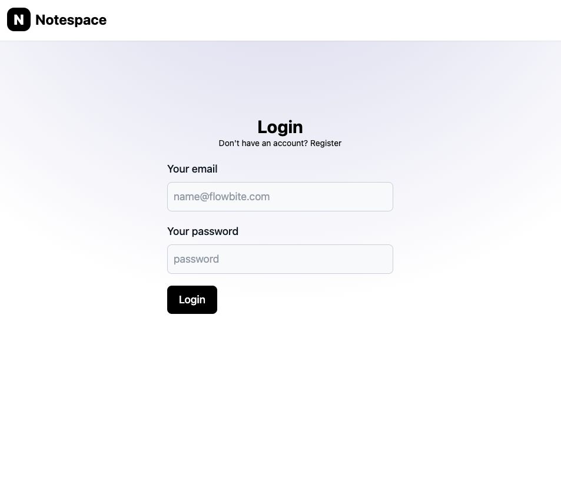
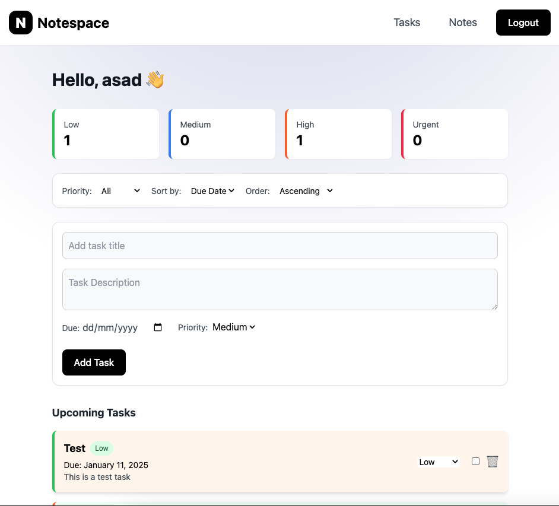
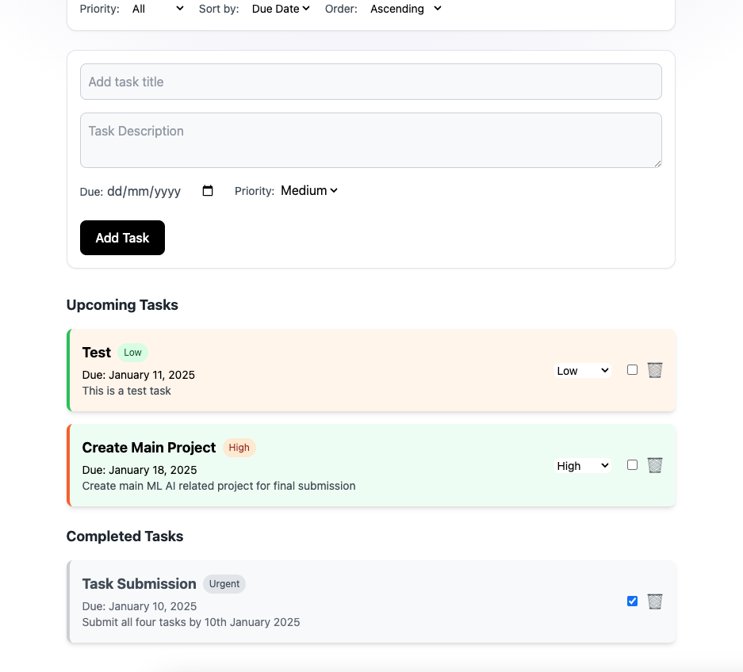
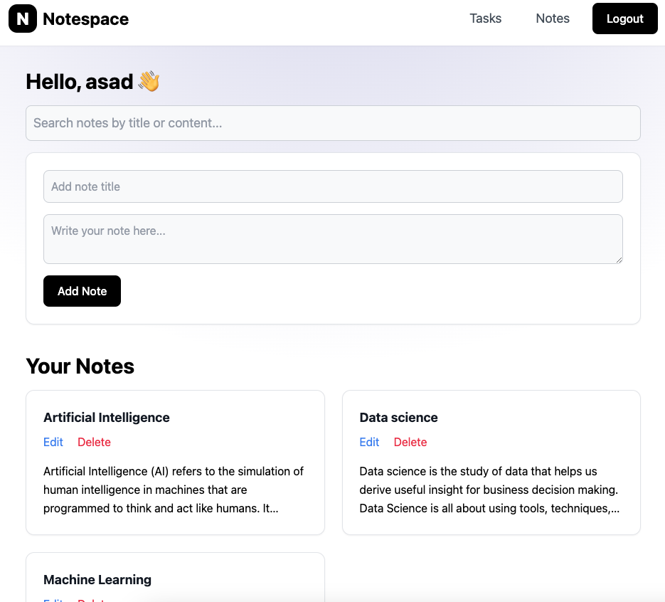
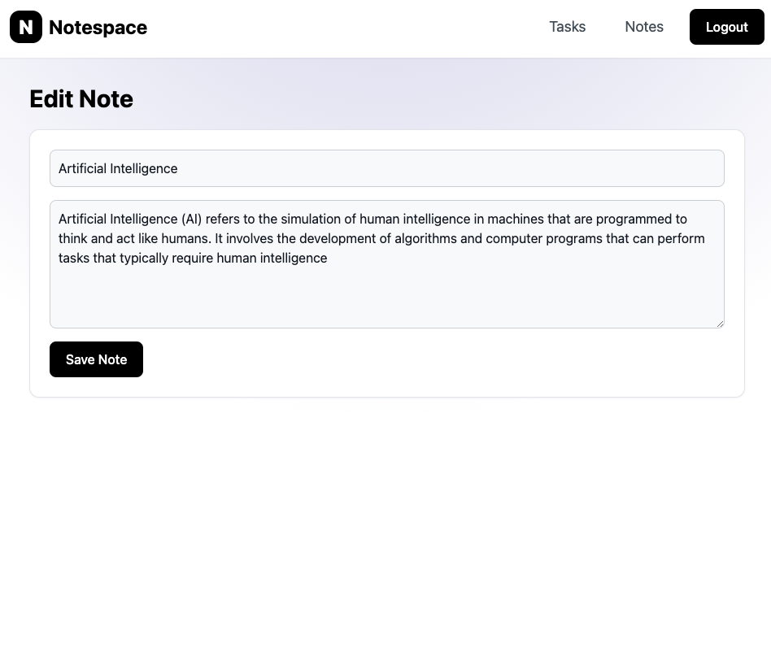
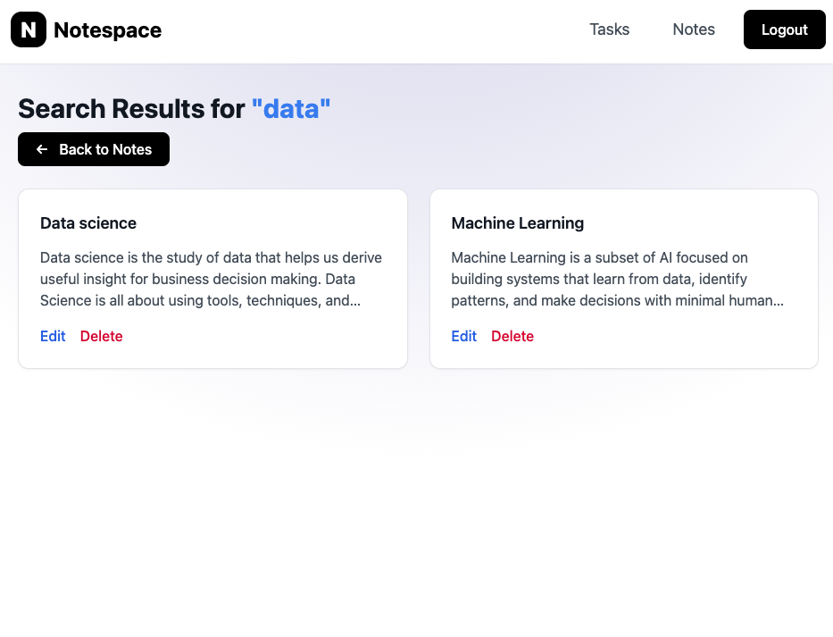

# Task Management + Notes Application

This is a Flask-based web application that allows users to manage tasks and notes effectively. The application includes user authentication, task management features like setting priorities and due dates, filters for viewing tasks, and a comprehensive notes section with CRUD functionality and search capabilities.

## Features

### Authentication

- **User Signup:** Create a new account.
- **User Login:** Access your account securely.

### Task Management

- **Create Tasks:** Add new tasks to your list.
- **Priority Management:** Assign or change task priority (e.g., High, Medium, Low).
- **Due Date:** Set due dates for tasks.
- **Filters:** View tasks based on priority or due date.

### Notes Management

- **Create Notes:** Add new notes.
- **Edit Notes:** Update the content of existing notes.
- **Delete Notes:** Remove notes no longer needed.
- **Search Notes:** Quickly find notes using keywords.

### Technologies Used

- Flask with Jinja templates
- Tailwind CSS for responsive and modern design
- PostgreSQL for storing user data, tasks, and notes

## Installation and Setup

### Prerequisites

- Python 3.8+
- PostgreSQL
- A virtual environment tool (optional but recommended)

### Steps

1. **Clone the repository**

   ```bash
   git clone https://github.com/asadsid004/Compozent_Tasks.git
   cd Compozent_Tasks/Task-2: API development using Flask
   ```

2. **Set up the virtual environment**

   ```python
   python3 -m venv venv
   source venv/bin/activate  # On Windows: venv\Scripts\activate
   ```

3. **Install dependencies**

   ```bash
   pip install -r requirements.txt
   ```

4. **Configure the database, secret-key**

   - Update the config.py file with:
     - `SECRET_KEY = "your-secret-key"`
     - `SQLALCHEMY_DATABASE_URI = "your-postgresql-connection-string"`

5. **Run database migrations**

   ```bash
   flask db init
   flask db migrate
   flask db upgrade
   ```

6. **Start the development server**
   ```bash
   flask run
   ```
   Access the application at http://127.0.0.1:5000.

## Usage

### Task Management

1. Log in to your account.
2. Navigate to the "Tasks" section.
3. Add, edit, prioritize, or filter tasks as needed.

### Notes Management

1. Log in to your account.
2. Navigate to the "Notes" section.
3. Add, edit, delete, or search through your notes.

## Outputs

1. Landing page:



2. Signup, Login Page:

 

3. Tasks:

 

4. Notes:

 

