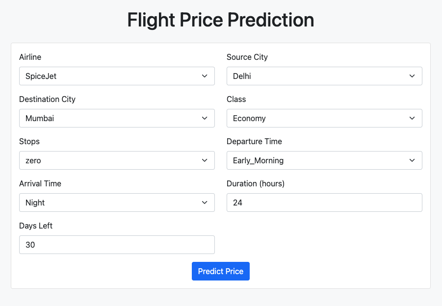
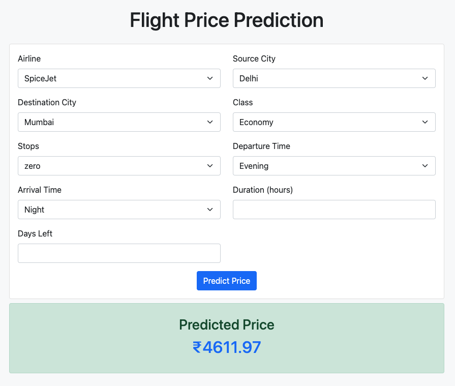

# Flight price prediction

The Flight Price Prediction Model is designed to predict the price of a flight based on a variety of factors such as departure and arrival locations, dates, airline, and other relevant variables. This is a regression model which uses Random Forest Regressor

Data source: [Kaggle](https://www.kaggle.com/datasets/shubhambathwal/flight-price-prediction)
(Download the main cleaned_dataset.csv)

## Requirements

- Python 3.x
- Scikit-Learn
- Numpy
- Pandas
- pickle
- matplotlib

## Installation

1. Clone the repository:

   ```bash
   git clone https://github.com/asadsid004/Compozent_Tasks.git
   cd Compozent_Tasks/Task-3: Machine learning project
   ```

2. Run the model/model.ipynb to generate the required pickle files for prediction

3. Run the following command:

   ```bash
   flask run
   ```

4. Access the site on http://localhost:5000

## Output



Prediction:


