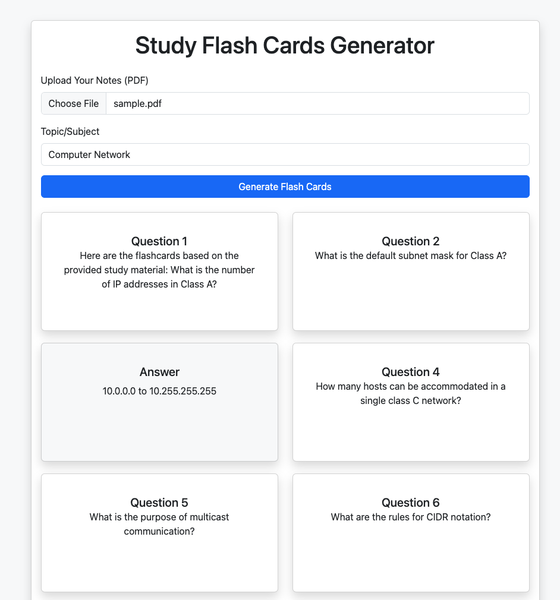

# PDF to Flashcards with Llama 3.2 and Ollama

This project converts PDF documents into flashcards using Llama 3.2 via Ollama. It extracts key information from the PDF and generates flashcards that can help with studying and reviewing the content.

## Requirements

- Python 3.x
- Ollama (Llama 3.2 model)
- PyPDF2 (or similar PDF parsing library)

## Installation

1. Clone the repository:

   ```bash
   git clone https://github.com/asadsid004/Compozent_Tasks.git
   cd Compozent_Tasks/Task-4(optional): Ollama project
   ```

2. Pull llama3.2

   ```bash
   ollama pull llama3.2
   ```

3. Run the following command:

   ```bash
   flask run
   ```

4. Access the side on http://localhost:5000

## Output


